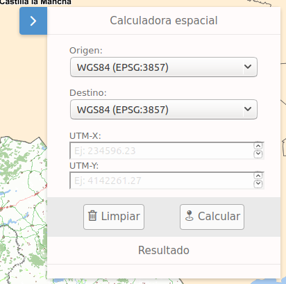

# M.plugin.SpatialCalculator

Transforma coordenadas de un sistema de referencia a otro aceptando también sistemas de referencia con coordenadas geográficas



## Dependencias

- spatialcalculator.ol.min.js
- spatialcalculator.ol.min.css


```html
 <link href="../../plugins/spatialcalculator/spatialcalculator.ol.min.css" rel="stylesheet" />
 <script type="text/javascript" src="../../plugins/spatialcalculator/spatialcalculator.ol.min.js"></script>
```

## Parámetros

- El constructor se inicializa con un JSON de _options_ con los siguientes atributos:

- **position**. Indica la posición donde se mostrará el plugin.
  - 'TL':top left
  - 'TR':top right (default)
  - 'BL':bottom left
  - 'BR':bottom right

- **classname**. campo que indica la clase principal del html del plugin.

- **tooltip**. campo que indica el texto que debe llevar el tooltip del plugin.

## Eventos

## Otros métodos

## Ejemplos de uso

### Ejemplo 1
```javascript
  const map = M.map({
    container: 'map'
  });

  const mp = new M.plugin.SpatialCalculator({
    position: 'TL',
    tooltip: 'Calculo de coordenadas',
    classname: 'm-spatialcalculator', 
  });

   map.addPlugin(mp);
```
### Ejemplo 2
```javascript
const map = M.map({
    container: 'map'
  });

const mp = new SpatialCalculator({});

map.addPlugin(mp);
```
